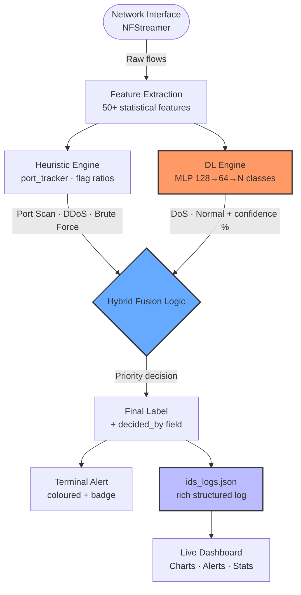
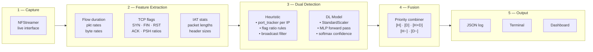
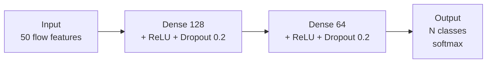
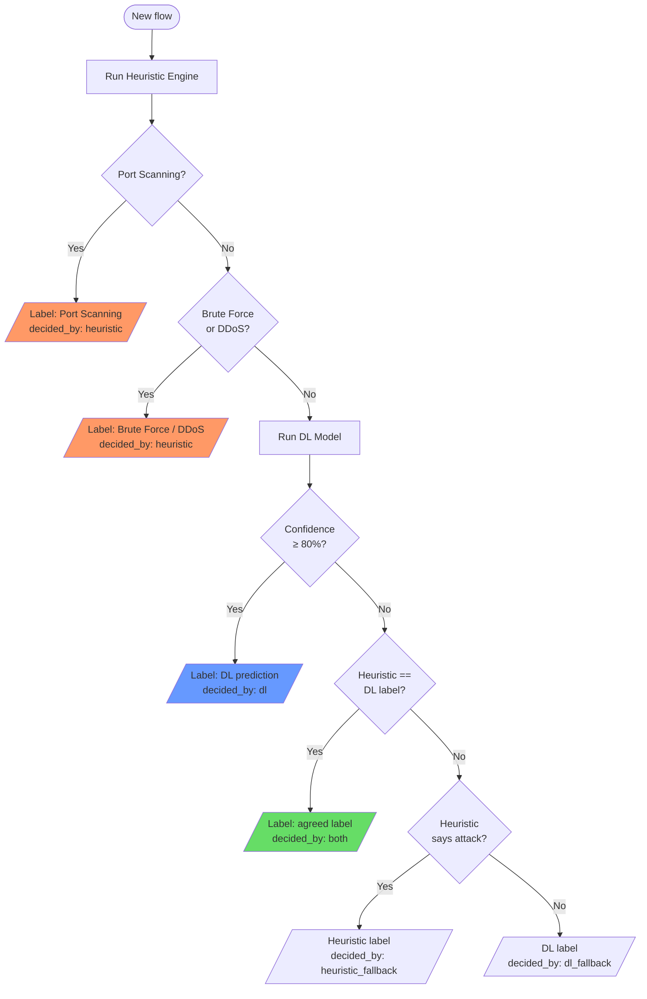
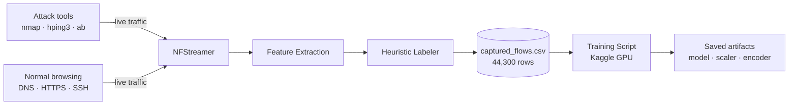
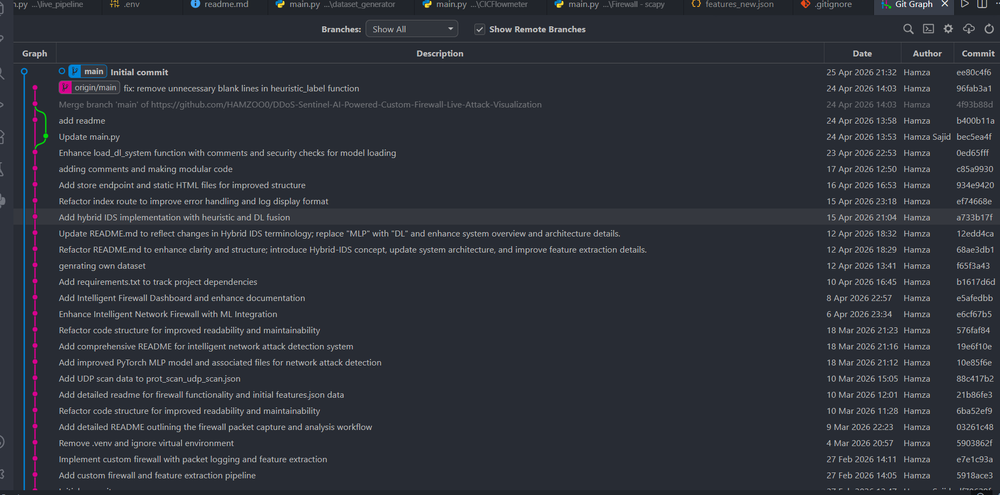

# DDoS Sentinel — AI-Powered Hybrid IDS with Live Attack Visualization

> A real-time Intrusion Detection System combining a **heuristic rule engine** and a **Deep Learning MLP** to detect DoS, DDoS, Port Scanning, and Brute Force attacks on live network traffic.

---

## Table of Contents

1. [Overview](#overview)
2. [System Architecture](#system-architecture)
3. [Detection Pipeline](#detection-pipeline)
4. [Attack Types Detected](#attack-types-detected)
5. [Deep Learning Model](#deep-learning-model)
6. [Hybrid Fusion Logic](#hybrid-fusion-logic)
7. [Dataset Generation](#dataset-generation)
8. [Project Structure](#project-structure)
9. [Setup & Installation](#setup--installation)
10. [Usage](#usage)
11. [JSON Log Format](#json-log-format)
12. [Visualization Dashboard](#visualization-dashboard)
13. [Results](#results)
14. [Future Work](#future-work)

---

## Overview

Modern networks face sophisticated threats that static firewall rules cannot catch alone. **DDoS Sentinel** tackles this by fusing two complementary detection approaches:

| Layer | Technology | Best At |
|---|---|---|
| Heuristic Engine | Rule-based (port tracker + flag ratios) | Port Scanning, DDoS, Brute Force |
| DL Engine | PyTorch MLP (128 → 64 → N) | DoS vs Normal Traffic |
| Fusion Logic | Priority-based combiner | Minimizing false positives |

The system captures live traffic via **NFStreamer**, extracts 50+ statistical flow features, runs both engines simultaneously, and writes structured JSON logs ready for dashboard visualization.

---

## System Architecture



---

## Detection Pipeline



---

## Attack Types Detected

| Attack | Detection Layer | Key Signals |
|---|---|---|
| **Port Scanning** | Heuristic only | `unique_dst_ports ≥ 20` per src IP |
| **SYN Flood** | Heuristic + DL | `syn_ratio > 0.7`, `pkts > 50`, no FIN |
| **UDP DDoS** | Heuristic | High pkt rate, short duration, not broadcast |
| **HTTP Flood** | Heuristic | High PSH ratio, one-sided traffic on port 80/443 |
| **DoS (general)** | DL (primary) | Learned flow patterns, MLP confidence ≥ 80% |
| **Brute Force** | Heuristic | Auth ports (22/21/3389), small packets, high count |
| **Normal Traffic** | Both agree | All thresholds clear, DL confident |

> **Why heuristic for Port Scanning?**
> A single nmap probe (1 packet, 0 duration) is byte-for-byte identical to a normal failed TCP connect. The only detectable signal is the *cross-flow pattern* — one IP hitting 20+ different ports — which the `port_tracker` dictionary tracks across flows in a way per-flow DL classification fundamentally cannot.

---

## Deep Learning Model

### Architecture



### Training Details

| Parameter | Value |
|---|---|
| Framework | PyTorch |
| Optimizer | Adam (lr=0.001) |
| Loss | CrossEntropyLoss (class-weighted) |
| Epochs | 100 |
| Balancing | Resample to max 5,000 per class |
| Scaler | StandardScaler |
| Classes trained | DoS · Normal Traffic |

### Saved Artifacts

```
DL model/
├── model.pkl          ← PyTorch state dict
├── scaler.pkl         ← StandardScaler
├── label_encoder.pkl  ← LabelEncoder
└── feature_cols.pkl   ← ordered feature list
```

---

## Hybrid Fusion Logic



### Terminal Badge Key

| Badge | Meaning |
|---|---|
| `[H]` | Heuristic was authoritative |
| `[D]` | DL was authoritative (high confidence) |
| `[H+D]` | Both layers agreed |
| `[H~]` | Heuristic fallback — DL was uncertain |
| `[D~]` | DL fallback — heuristic said Normal |

---

## Dataset Generation

The custom dataset was generated using `dataset genrater/main.py` which runs NFStreamer on a live interface and applies the heuristic labeler to every flow.



### Dataset Stats

| Label | Rows | Notes |
|---|---|---|
| DoS | 35,597 | hping3 SYN flood, HTTP flood |
| Port Scanning | 5,981 | nmap -sS, -sU, -sA |
| Normal Traffic | 2,722 | browsing, DNS, HTTPS |
| **Total** | **44,300** | — |

> **Note:** Port Scanning rows have `Total Fwd Packets = 1` and `Flow Duration ≈ 0` by nature. The training filter must not delete these. The DL model was trained on DoS vs Normal only — Port Scanning detection is handled entirely by the heuristic layer.

---

## Project Structure

```
DDoS-Sentinel/
│
├── hybrid_ids.py              ← Main hybrid IDS (run this)
│
├── dataset genrater/
│   └── main.py                ← Captures flows + heuristic labels → CSV
│
├── NFStreamer/
│   └── ids.py                 ← Original DL-only inference script
│
├── DL model/
│   ├── model.pkl
│   ├── scaler.pkl
│   ├── label_encoder.pkl
│   └── feature_cols.pkl
│
├── Firewall - scapy/          ← Scapy-based packet capture
├── CICFlowmeter/              ← Alternative feature extraction
│
├── captured_flows.csv         ← Generated dataset
├── ids_logs.json              ← Live detection log (dashboard input)
├── features_new.json          ← Scapy firewall feature log
├── requirements.txt
└── README.md
```

---

## Setup & Installation

### Requirements

```bash
pip install -r requirements.txt
```

### requirements.txt includes

```
nfstream
torch
scikit-learn
joblib
numpy
pandas
scapy
```

### Windows — find your network interface

```bash
python check_iface.py
```

Copy the interface string (e.g. `\Device\NPF_{F5DC9C1F-...}`) into `hybrid_ids.py` → `WIN_INTERFACE`.

---

## Usage

### Run the Hybrid IDS

```bash
python hybrid_ids.py
```

### Run the Dataset Generator (to collect more data)

```bash
python "dataset genrater/main.py"
```

### Expected terminal output

```
════════════════════════════════════════════════════════════════════════════════
  Hybrid IDS  —  Heuristic + DL Fusion
════════════════════════════════════════════════════════════════════════════════
  Interface      : \Device\NPF_{...}
  JSON log       : ids_logs.json
  DL conf thresh : 80%
  Scan threshold : 20 unique ports

[15:42:01] #312   [H]    192.168.10.50    → 192.168.10.5   port=8080  TCP  pkts=1     Port Scanning
[15:42:01] #313   [D]    192.168.10.102   → 52.12.3.14     port=443   TCP  pkts=214   Normal Traffic
[15:42:02] #314   [H~]   10.0.0.4         → 192.168.10.5   port=80    TCP  pkts=9420  DoS
```

---

## JSON Log Format

Every detected flow is appended to `ids_logs.json`. Each entry contains:

```json
{
  "timestamp":         "2026-04-12T15:42:01.334",
  "source_ip":         "192.168.10.50",
  "dest_ip":           "192.168.10.5",
  "dest_port":         8080,
  "protocol":          "TCP",

  "final_label":       "Port Scanning",
  "is_attack":         true,
  "decided_by":        "heuristic",

  "dl_prediction":     "Normal Traffic",
  "dl_confidence":     0.6231,

  "heuristic_label":   "Port Scanning",
  "unique_ports_seen": 24,
  "flows_from_ip":     24,

  "packet_count":      1,
  "pkt_per_sec":       1000.0,
  "bytes_per_sec":     45000.0,
  "duration_ms":       0,

  "flags": {
    "SYN": 1, "FIN": 0, "RST": 0, "ACK": 0, "PSH": 0
  }
}
```

The `decided_by` field lets the dashboard show which layer caught each attack — a key differentiator of the hybrid approach.

---

## Visualization Dashboard

The `ids_logs.json` file feeds a real-time dashboard showing:

- Live traffic timeline (Normal vs Attack)
- Label distribution pie chart
- Per-IP alert feed with confidence scores
- Decision source breakdown (`[H]` vs `[D]` vs `[H+D]`)
- Flag heatmap (SYN / FIN / RST / PSH per flow)
- Top attacking IPs ranked by flow count

---

## Results

| Metric | Value |
|---|---|
| DL model accuracy (test set) | ~97–100% on DoS vs Normal |
| Port Scan detection | 100% via heuristic (threshold-based) |
| False positives (Normal flagged as attack) | Near zero with hybrid fusion |
| False negatives (scan missed) | Zero after threshold = 20 ports |
| JSON log latency | Per-flow, real-time |

> The 100% accuracy on the test set reflects the simplicity of the binary problem (DoS vs Normal) and a clean dataset. Real-world generalization is strengthened by the heuristic layer acting as a safety net when DL confidence drops below 80%.

---

## Future Work

- **Window-based DL features** — aggregate per-IP per-60s window, add `unique_dst_ports` and `avg_pkts_per_flow` as DL inputs so Port Scanning can eventually be learned by the model
- **1D-CNN / LSTM** — temporal sequence model over flow windows
- **Transformer-based detection** — attention over packet sequences
- **Auto firewall rule generation** — block attacking IPs via Windows Firewall API
- **SIEM integration** — push alerts to Splunk / Elastic
- **Geolocation overlay** — map external attacker IPs
- **Graph-based detection** — model IP-to-IP communication as a network graph

---

## License

MIT — see [LICENSE](LICENSE)

---

*Built by Hamza Sajid · DDoS Sentinel · 2026*


---
delete all commnets due to privacy 
