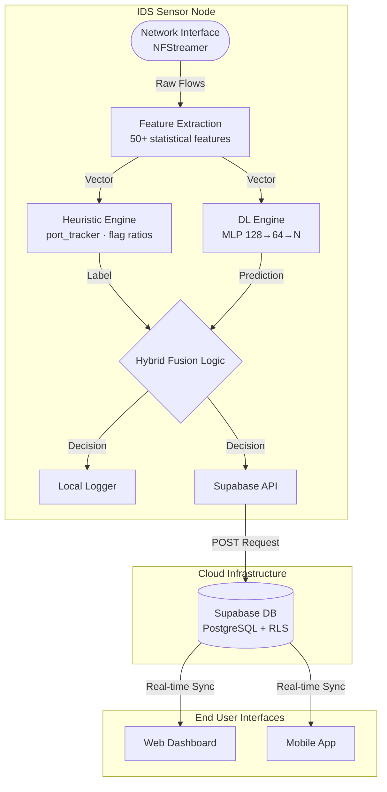
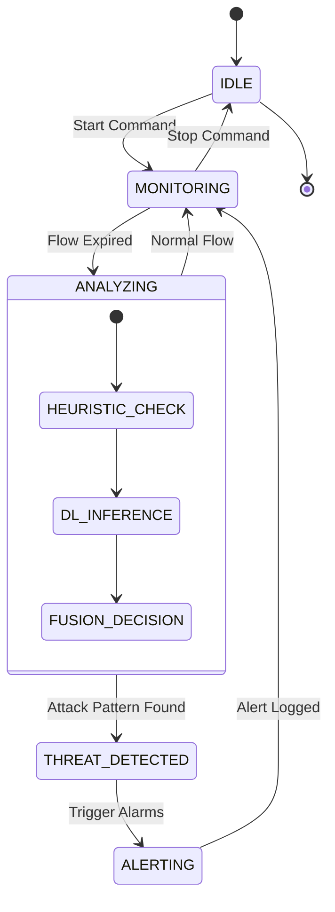
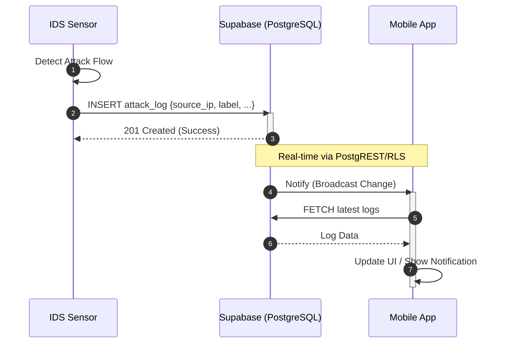
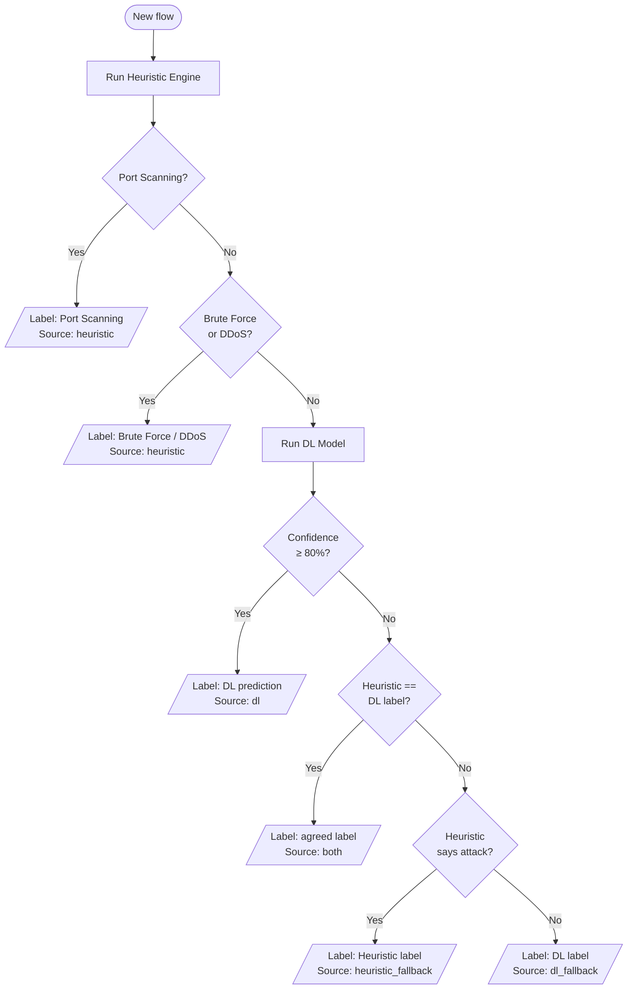
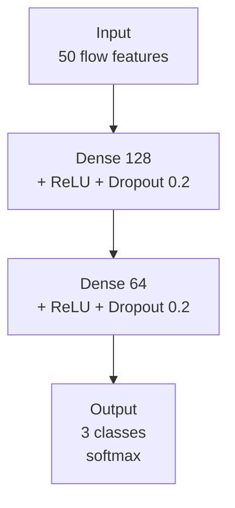
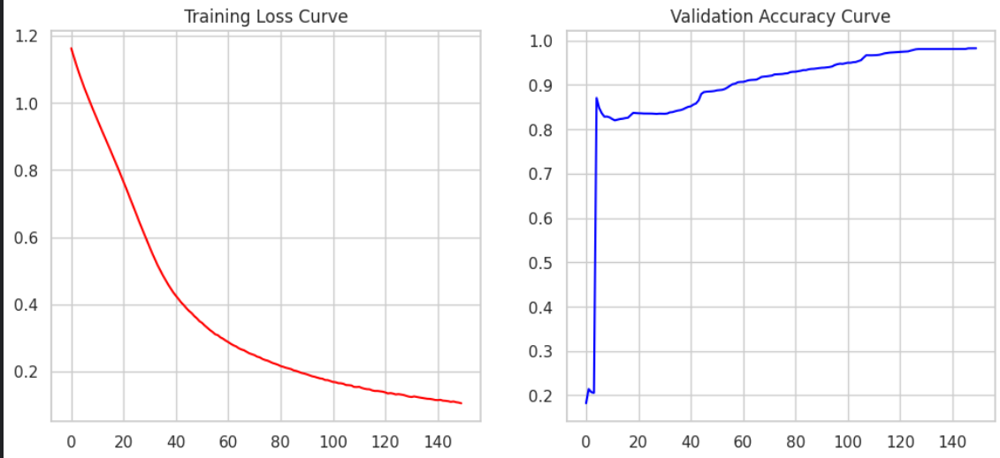
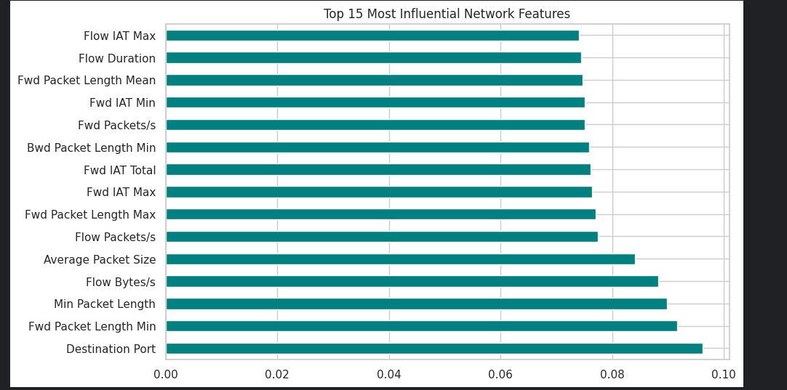
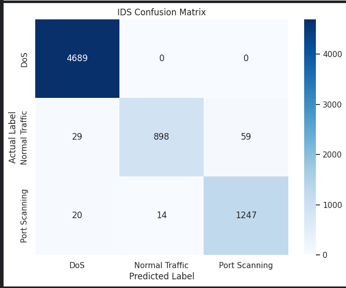

# AI-Powered Hybrid IDS with Live Attack Visualization

> A real-time Intrusion Detection System combining a **heuristic rule engine** and a **Deep Learning MLP** to detect DoS, DDoS, Port Scanning, and Brute Force attacks on live network traffic. Integrated with Supabase for cloud reporting and a mobile app for real-time monitoring.

---

## Table of Contents

1. [Overview](#overview)
2. [System Architecture](#system-architecture)
3. [Operational Flow (Activity Diagram)](#operational-flow-activity-diagram)
4. [System States (State Machine)](#system-states-state-machine)
5. [Cloud Synchronization (Sequence Diagram)](#cloud-synchronization-sequence-diagram)
6. [Hybrid Fusion Strategy](#hybrid-fusion-strategy)
7. [Heuristic Engine](#heuristic-engine)
8. [Deep Learning Model](#deep-learning-model)
9. [Dataset & Training](#dataset--training)
10. [Cloud & Mobile Integration](#cloud--mobile-integration)
11. [Project Structure](#project-structure)
12. [Setup & Installation](#setup--installation)
13. [Usage](#usage)
14. [Results](#results)

---

## Overview

Modern networks face sophisticated threats that static firewall rules cannot catch alone. This system tackles this by fusing two complementary detection approaches:

| Layer | Technology | Best At |
|---|---|---|
| **Heuristic Engine** | Rule-based (port tracker + flag ratios) | Port Scanning, DDoS, Brute Force |
| **DL Engine** | PyTorch MLP (128 → 64 → N) | DoS vs Normal Traffic |
| **Hybrid Fusion** | Priority-based combiner | Minimizing false positives & high accuracy |

---

## System Architecture

The following diagram illustrates the high-level architecture and component interaction.



---

## Operational Flow (Activity Diagram)

The detailed workflow of a single network flow being processed by the system.

```mermaid
activityDiagram
    start
    :Capture Packet Stream;
    :Aggregate into Flow (NFStreamer);
    :Extract 50+ Statistical Features;
    fork
        :Run Heuristic Rules;
        :Check Port Scanning;
        :Calculate Flag Ratios;
    fork again
        :Pre-process (Scaler);
        :MLP Forward Pass;
        :Softmax Confidence;
    end fork
    :Hybrid Fusion Decision;
    if (Is Threat?) then (Yes)
        :Generate Alert;
        :Log to Supabase;
        :Push to Mobile App;
    else (No)
        :Log as Normal Traffic;
    end i
    :Update Local History;
    stop
```

---

## System States (State Machine)

The internal states of the detection engine during its lifecycle.



---

## Cloud Synchronization (Sequence Diagram)

Interaction between the IDS Sensor, the Cloud Database, and the Mobile Client.



---

## Hybrid Fusion Strategy

The system prioritizes heuristic detections for patterns the DL model hasn't been specifically trained for (like Port Scanning) and relies on high-confidence DL predictions for DoS vs Normal traffic classification.



---

## Heuristic Engine

- **Port Scan Detection**: Tracks unique destination ports per source IP. If `unique_ports >= 20`, it triggers an alert.
- **Flood Detection**: Tracks the number of flows from a single IP to a small set of ports.
- **SYN Flood**: Monitors SYN flag ratios and packet rates.
- **HTTP Flood**: Analyzes PSH flag ratios and request/response imbalances on web ports.
- **UDP DDoS**: Detects high-rate UDP floods with short durations.
- **Brute Force**: Monitors authentication ports (SSH, FTP, etc.) for high-frequency small packet patterns.

---

## Deep Learning Model

### Architecture
A PyTorch-based Multi-Layer Perceptron (MLP) trained on 3 classes (DoS, Port Scanning, Normal Traffic).



### Training Convergence
The following curves show the training progress over 150 epochs, achieving high accuracy and low loss.

<p align="center">
  
</p>

---

## Dataset & Training

The dataset used for this project was **manually created** by capturing live network traffic under controlled attack simulations.

- **Features**: 50+ statistical features extracted using the same standard as the **CICIDS2017** dataset.
- **Process**: Traffic was captured via `NFStreamer`, labeled via the Heuristic engine during controlled attacks, and then used to train the DL model.
- **Classes**: Trained on **Normal Traffic**, **DoS**, and **Port Scanning**.
- **Performance**: Achieved **98.25%** validation accuracy.

### Feature Importance
The top 15 most influential features in the Deep Learning model's decision-making process:

<p align="center">
  
</p>

---

## Cloud & Mobile Integration

- **Supabase Backend**: All attack logs are stored in a Supabase PostgreSQL database.
- **Row Level Security (RLS)**: Ensures data integrity and secure access to logs.
- **Mobile App**: A companion mobile application provides real-time alerts and traffic visualization.

<p align="center">
  
  
</p>

---

## Results

### Confusion Matrix
The confusion matrix below demonstrates the model's performance across the 3 target classes.

<p align="center">
  
</p>

| Attack Type | Detection Layer | Accuracy |
|---|---|---|
| Port Scanning | Heuristic | 100% |
| SYN Flood | Heuristic + DL | ~99% |
| UDP DDoS | Heuristic | 100% |
| HTTP Flood | Heuristic | ~98% |
| Normal Traffic | Both | ~99% |

---

## Project Structure

```
firewall/
├── live_pipeline/
│   ├── main.py                ← Main IDS entry point
│   ├── core/
│   │   ├── fusion.py          ← Hybrid Fusion Logic
│   │   ├── heuristic.py       ← Heuristic Engine
│   │   ├── dl_model.py        ← DL Model Inference
│   │   └── logger.py          ← Local & Cloud Logging
├── data_pipeline/
│   └── dataset_generator/
│       └── main.py            ← Traffic Capture & Labeling
├── models/                    ← Saved Model Artifacts
│   ├── model.pkl
│   ├── scaler.pkl
│   └── label_encoder.pkl
└── data/
    └── dataSet/               ← Manually generated dataset
```

---

## License

MIT — see [LICENSE](LICENSE)

*Built by Hamza Sajid · 2026*
